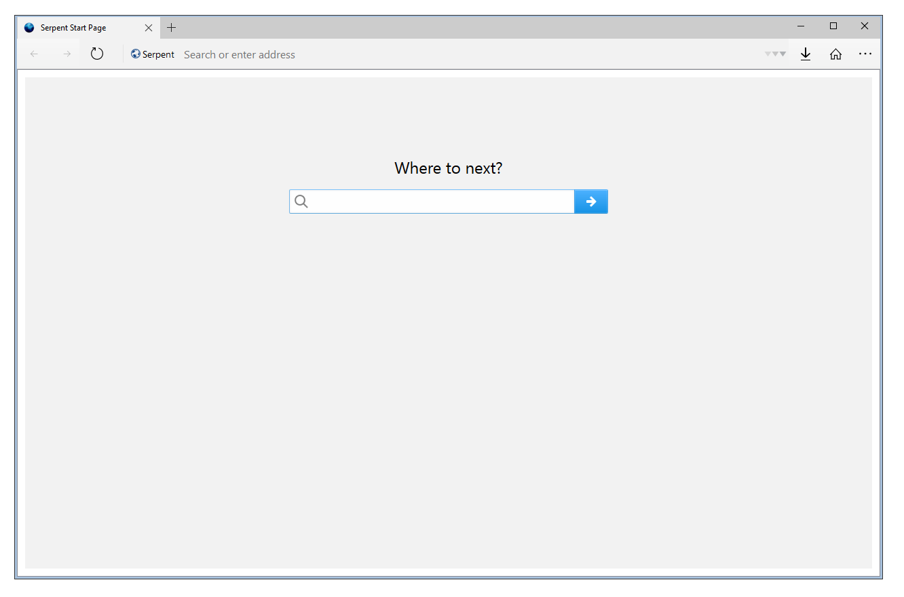

# Dactyloidae web browser
<a href="https://discord.gg/46AFkK9QnX">Official Discord server</a>
  

Dactyloidae is a fork of Eclipse Lun3r (fork of Pale Moon made for Windows XP).

Some advantages over upstream, roytam1's New Moon and Lun3r are:
- More optimzations
- Better interoperability with upstream. (using SQL storage intead of DBM)
- More modern theme
- Better e10s support

## Credits
@Eclipse-Community for original code

@SoftBluey for logo seen in README and About 

